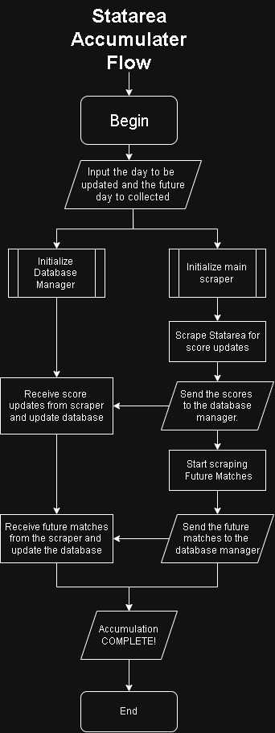

# ⚽ Football Edge Research Platform

A modular football data pipeline designed to collect, accumulate, and validate match data with strict temporal integrity — built for structured analytics and edge research.

---

## 📌 Overview

This project automates the daily collection and update of football match data while preserving time-awareness and reproducibility.

It is structured as a scalable research framework — not a one-off scraping script.

Key focus areas:

- Controlled data ingestion
- Separation of future fixtures and historical results
- Traceable feature engineering
- Modular, extensible architecture

---

## 🎯 Core Principles

- **No post-match leakage**  
  Statistics are generated without using future outcomes.

- **Traceable inputs**  
  Every feature and record links back to raw scraped data.

- **Temporal correctness**  
  Future fixtures and completed matches are stored and updated separately.

- **Extensibility**  
  New leagues, metrics, and data sources can be added without rewriting the system.

---

## 🧱 System Architecture

The platform is built around modular components working under a central orchestration layer.

## 📐 Architecture Overview

The diagram below illustrates how the `StatareaAccumulator` orchestrates daily scraping, future match tracking, and historical score updates.

<p align="center">
  
  <br>
  <em>High-level orchestration flow of the StatareaAccumulator.</em>
</p>


At a high level, the system:

1. Updates recently completed matches (shallow scrape)
2. Collects upcoming fixtures (deep scrape)
3. Preserves historical integrity
4. Stores validated data for downstream feature generation

---

## 🧩 Core Components

### 1️⃣ Scrapers
- Extract fixtures, predictions, and match statistics
- Handle retries, timeouts, and failed link tracking
- Designed for automation and reliability

### 2️⃣ Accumulators
- Maintain time-aware datasets
- Separate:
  - Future fixtures
  - Historical score updates
- Includes `StatareaAccumulator` (formerly `StatareaCompounder`)
- Central orchestration logic for daily updates

### 3️⃣ Database Layer
- Stores raw and derived data
- Enforces unique constraints
- Maintains auditability and integrity

### 4️⃣ Feature Engineering
- Rolling statistics
- Last-N match form
- Head-to-head records
- Team betting statistics
- Structured for ML pipelines or rule-based signal systems

### 5️⃣ Dashboard (Planned)
- Update status visualization
- Failed scrape monitoring
- Automated daily health checks

---

## 📊 Project Status

| Component | Status |
|------------|--------|
| Data Ingestion | ✅ Complete |
| Accumulator Logic | ✅ Complete |
| Feature Derivation | ⏳ In Progress |
| Predictive Modeling | ⏳ Planned |
| Monitoring Dashboard | ⏳ Planned |

---

## 🗺 Roadmap

- Add additional data sources
- Expand derived statistical features
- Integrate predictive models / signal evaluation
- Automate full daily pipeline execution
- Deploy scheduled cloud-based execution

---

## 🚀 Getting Started

### Clone the repository

```bash
git clone <repo-url>
cd football-edge-platform
Install dependencies
pip install -r requirements.txt
```
```python
#Run daily accumulator
from StatareaAccumulator import StatareaAccumulator

acc = StatareaAccumulator(future_days=5, update_scores_days=3)
acc.accumulate_daily()
```
🧠 Design Intent
This project prioritizes clarity, reproducibility, and structured data accumulation.

It is built to support long-term analytics, controlled experimentation, and scalable feature research — while remaining modular and production-ready.